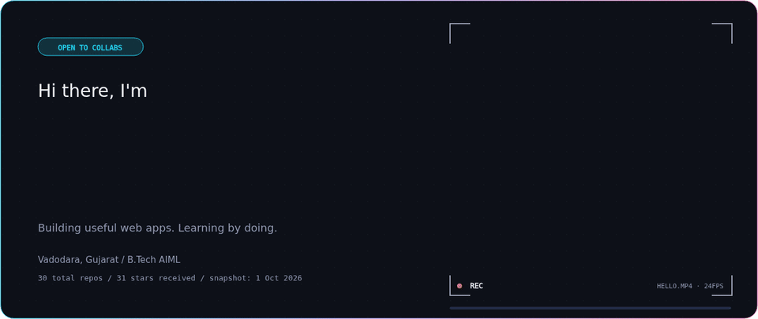
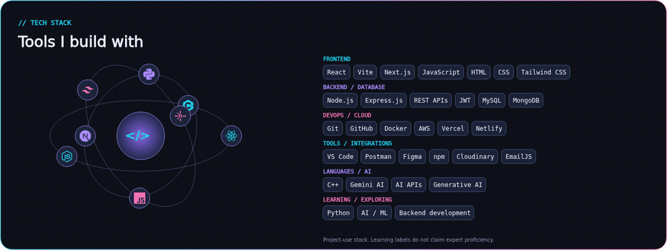
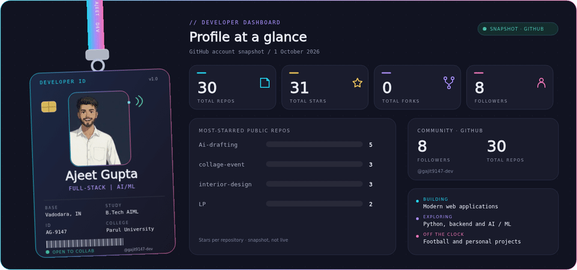
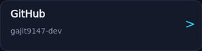
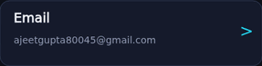
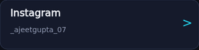
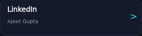

  

  

  

## Featured builds
| Project | What it is | Language |
| --- | --- | --- |
| [UPI Scam Shield](https://github.com/gajit9147-dev/upi-scam-shield) | AI-assisted UPI/payment scam-message detection | JavaScript |
| [innerVoice](https://github.com/gajit9147-dev/innerVoice) | JavaScript project | JavaScript |
| [Laundry booking app](https://github.com/gajit9147-dev/LP) | Laundry booking web app | HTML |

<!-- Contribution-city image intentionally omitted until the proposal is approved and a first run succeeds. -->

 

Build. Learn. Repeat.

